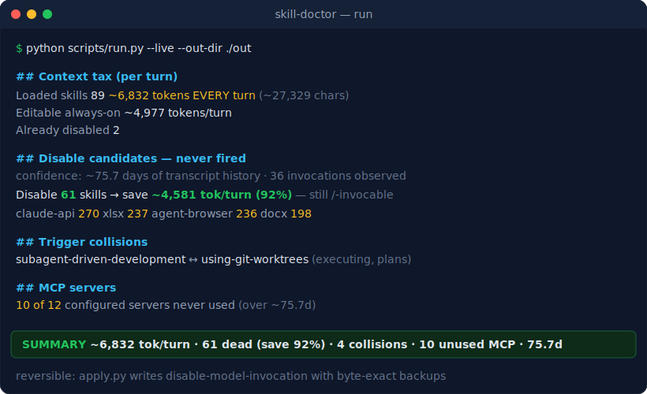

<div align="center">


&nbsp;

### Diagnose your Claude Code skill library — and cut the per-turn token tax.

[](https://github.com/ssamba1/skill-doctor/actions/workflows/ci.yml)
[](https://github.com/ssamba1/skill-doctor/releases)
[](LICENSE)
[](https://www.python.org)
[](#)

[Quickstart](#quickstart) · [What it finds](#what-it-finds) · [Proof](#proven-on-real-data) · [Compare](#how-it-compares) · [FAQ](#faq)

</div>

---

> **Every auto-invocable skill injects its description into _every single request_ — fired or not.**
> On a real machine, 89 installed skills cost **~6,832 tokens before you even type.**

Claude Code surfaces this only per-*plugin* and never flags trigger collisions, so your standalone
skills are a blind spot. **skill-doctor diagnoses the library you already have — and writes the
prescription.** Reads your real transcripts + the live injected payload; edits nothing without your
say-so; sends nothing anywhere. Stdlib-only Python, zero dependencies.

## Quickstart

```bash
git clone https://github.com/ssamba1/skill-doctor && cd skill-doctor
python scripts/run.py --live --out-dir ./out        # diagnose → ./out/report.md
python scripts/apply.py --from-actions ./out/actions.json --write   # treat (reversible)
```

Or install as a skill, then just ask *"audit my skills"*:

```bash
/plugin marketplace add ssamba1/skill-doctor
```

## What it finds

| check | what it surfaces |
|---|---|
| 🩺 **Context tax** | exact tokens each skill injects per turn (from the live `skill_listing`) — total, per-skill A–F grades, worst offenders |
| 📉 **Budget check** | whether you're over Claude Code's `skillListingBudgetFraction` (~2k tokens) — past it, descriptions get silently shortened/dropped |
| 💀 **Dead weight** | skills that never fire, mined from your transcripts, backed by a confidence line (days of history) |
| ✂️ **Compression** | skills you *keep* but whose descriptions are bloated — trim to minimal routing-correct form, no disabling |
| ⚔️ **Collisions & duplicates** | descriptions that overlap enough to ambiguously co-trigger; near-identical skills where one is redundant |
| 🕰️ **Staleness** | deprecated model identifiers left in skill bodies |
| 🔌 **MCP audit** | configured-but-never-used MCP servers (another always-on drain) |

The fix is reversible: `apply.py` writes `disable-model-invocation` to *your own* skills only, with
byte-exact backups (`--revert --write` undoes everything). Disabled skills still run with `/name` —
they just stop loading on every turn.

## See it run

<div align="center">

</div>

## Proven on real data

skill-doctor predicted ~4,581 tokens of savings on an 89-skill machine. After applying its fixes, the
**actual `skill_listing` payload measured from the session logs** dropped — the mechanism, not just an estimate:

| | skills loaded | injected chars | ~tokens / turn |
|---|---|---|---|
| **before** | 89 | 27,329 | ~6,832 |
| **after** | **49** | **7,978** | **~1,994** |

**Measured reduction: ~4,838 tokens every turn** — verifiable in your own `~/.claude/projects/*.jsonl`.

Bloat isn't only a cost problem: scaling to a 202-skill library drops agent accuracy by up to **21%**
([Skill Shadowing, arXiv 2605.24050](https://arxiv.org/abs/2605.24050)), and ~48% of descriptions are
compressible with ~86% functional retention ([SkillReducer, arXiv 2603.29919](https://arxiv.org/abs/2603.29919)).
Fewer, sharper skills route better.

## How it compares

| | **skill-doctor** | `/plugin` (built-in) | static inspectors | doing nothing |
|---|:---:|:---:|:---:|:---:|
| Per-**skill** cost (incl. standalone) | ✅ | per-plugin only | ❌ | ❌ |
| Never-fired, from real transcripts | ✅ | per-plugin telemetry | ❌ | ❌ |
| Trigger collisions / duplicates | ✅ | ❌ | some | ❌ |
| Description compression | ✅ | ❌ | ❌ | ❌ |
| Unused MCP servers | ✅ | ❌ | ❌ | ❌ |
| Reversible one-command fixes | ✅ | manual | ❌ | ❌ |

## Tools

| script | purpose |
|---|---|
| `run.py` | run the whole pipeline → `report.md` + `actions.json` |
| `scan.py` | inventory + per-skill cost + grades + budget + staleness |
| `usage.py` | per-skill firing history from transcripts |
| `collide.py` | trigger-collision + duplicate shortlist |
| `compress.py` | flag verbose descriptions to slim |
| `apply.py` | apply/revert `disable-model-invocation`; auto-rewrite descriptions (guarded) |
| `mcpusage.py` | flag configured-but-unused MCP servers |
| `context.py` | unified always-on budget (skills + CLAUDE.md + rules), ranked |
| `monitor.py` | record per-session usage durably (SessionEnd hook); `--summary` |
| `lint.py` | score a candidate skill before adding it (cost + collision + routing) |
| `evalgate.py` | generate trigger probes to confirm a change didn't break routing |

<details>
<summary><b>How it works & the subtleties it gets right</b></summary>

<br>

- Scripts emit deterministic JSON facts; the one judgment call (confirming a collision, rewriting a description) is made by the model from the shortlist.
- `paths`-scoped skills load only for matching files → excluded from the always-on tax, never proposed for disabling.
- Attribution-only fires (some slash commands) count as "used", so they're never mis-flagged as dead.
- Token figures are offline estimates (~4 chars/token); **percentages are tokenizer-independent**. Add `--exact` (with `ANTHROPIC_API_KEY`) for precise counts via the count_tokens API.
- "Never fired" is framed by how many days of transcript history back it.
- Verified Claude Code internals it relies on: [`references/mechanics.md`](references/mechanics.md).

</details>

## FAQ

**Is it safe? Will it delete my skills?** No deletion. `apply.py` only edits the frontmatter of your
own personal/project `SKILL.md` files (never plugin/bundled skills), writes a `.bak`, replaces
atomically, and reverts byte-exact. "Disabling" just stops *automatic* loading — the skill still runs
with `/name`.

**Does it send my data anywhere?** No. Everything runs locally over your `~/.claude` files. The only
network call is the opt-in `--exact` mode, which sends skill *descriptions* (not transcripts, not your
code) to Anthropic's count_tokens API — off by default.

**Cross-platform?** Yes — Windows, macOS, Linux; Python 3.11+. No dependencies.

**How accurate are the token numbers?** Offline estimates by default; **percentages and the
before/after listing measurement are tokenizer-independent**. Use `--exact` for precise absolute counts.

## Quality

```bash
python -m pytest tests/ -q                            # 86 hermetic tests
SKILL_DOCTOR_DOGFOOD=1 python -m pytest tests/ -q     # + 4 real-machine checks
```

Stdlib-only, **zero dependencies**. 91% coverage (CI-gated). CI on Linux + Windows × Python 3.11/3.12.
Unit + CLI-smoke + property/fuzz tests; independently break-tested against malformed and adversarial inputs.

## Roadmap

See the [`roadmap`](https://github.com/ssamba1/skill-doctor/issues?q=label%3Aroadmap) issues —
continuous-usage dashboard, enterprise governance, ML skill recommender.

## License

MIT · contributions welcome ([CONTRIBUTING.md](CONTRIBUTING.md))
