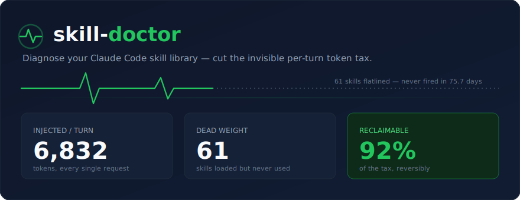
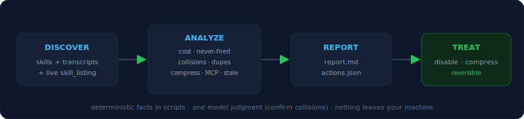

<a id="readme-top"></a>

<div align="center">



### Diagnose your Claude Code skill library — and cut the per-turn token tax.

[](https://github.com/ssamba1/skill-doctor/actions/workflows/ci.yml)
[](#quality--testing)
[](https://github.com/ssamba1/skill-doctor/releases)
[](LICENSE)
[](https://www.python.org)
[](#built-with)

[Demo](#demo) · [Quickstart](#quickstart) · [Usage](#usage) · [Proof](#proven-on-real-data) · [Compare](#how-it-compares) · [FAQ](#faq--troubleshooting)

</div>

<details>
<summary><b>Table of Contents</b></summary>

- [About The Project](#about-the-project)
  - [Demo](#demo)
  - [Built With](#built-with)
  - [Why skill-doctor](#why-skill-doctor)
  - [When not to use it](#when-not-to-use-it)
- [Getting Started](#getting-started)
  - [Prerequisites](#prerequisites)
  - [Installation](#installation)
  - [Quickstart](#quickstart)
- [Usage](#usage)
  - [The report, section by section](#the-report-section-by-section)
  - [Applying fixes](#applying-fixes)
  - [Tool reference](#tool-reference)
  - [Continuous monitoring](#continuous-monitoring)
  - [Configuration & flags](#configuration--flags)
- [How It Works](#how-it-works)
- [Proven on Real Data](#proven-on-real-data)
- [How It Compares](#how-it-compares)
- [FAQ & Troubleshooting](#faq--troubleshooting)
- [Roadmap](#roadmap)
- [Contributing](#contributing)
- [License](#license)
- [Contact](#contact)
- [Acknowledgments](#acknowledgments)

</details>

---

## About The Project

Claude Code [Agent Skills](https://code.claude.com/docs/en/skills) are powerful — but there's a hidden
cost. **Every auto-invocable skill injects its `name` + `description` into the system prompt on _every
single request_, whether that skill ever fires or not.** Install a few skill packs and you're silently
paying a tax on every message: on a real machine, **89 installed skills ≈ 6,832 tokens per turn before
you even type.**

Claude Code's built-in tooling surfaces this only **per-plugin** (`/plugin`) and never flags trigger
collisions — so your dozens of *standalone* skills, the ones that overlap, the ones that went stale,
and the ones you installed and never used are a complete blind spot.

**skill-doctor is a usage- and cost-aware auditor for the skill library you already have.** It reads
your real transcripts and the live injected payload, measures what each skill actually costs, proves
which ones never fire, finds collisions and duplicates, and writes **reversible** fixes that cut the
tax — measured at **~92%** on a real library. It runs locally, edits nothing without your say-so, and
has **zero dependencies**.

### Demo

<div align="center">

</div>

### Built With

- **[Python 3.11+](https://www.python.org)** — standard library only, **no third-party dependencies**
- **[GitHub Actions](https://github.com/features/actions)** — CI on Linux + Windows × Python 3.11 / 3.12
- **pytest** + **coverage** (dev only) — 86 tests, 91% coverage with an enforced gate

No build step, no install of packages, no network calls (except opt-in exact token counting).

<p align="right">(<a href="#readme-top">back to top</a>)</p>

### Why skill-doctor

- You've installed skill packs — and every description loads **every turn**, used or not.
- Claude Code shows cost only **per-plugin**; standalone skills, collisions, and stale entries are invisible.
- Past the `skillListingBudgetFraction` (~2k tokens) Claude Code **silently drops** descriptions — so skills you think are loaded may not be.
- Its fixes are **reversible and evidence-backed** (real before/after from your logs), not guesses.
- It catches what static inspectors can't: real **firing history** and real **token cost**, mined from your machine.

### When not to use it

- You have only a handful of skills — the tax is negligible; don't bother.
- You want to *create* a skill — use [`skill-creator`](https://github.com/anthropics/skills). skill-doctor audits what you've **already installed**.
- You need org-wide fleet governance across many developers — that's [roadmap](#roadmap), not shipped.

<p align="right">(<a href="#readme-top">back to top</a>)</p>

---

## Getting Started

### Prerequisites

- **Python 3.11 or newer** (`python --version`). No `pip install` needed — standard library only.
- **Claude Code** with some skills installed (personal `~/.claude/skills/`, project `.claude/skills/`, or plugins).
- *(Optional)* an `ANTHROPIC_API_KEY` env var — only if you want exact token counts via `--exact`.

### Installation

**Option A — clone and run (recommended for first use):**

```bash
git clone https://github.com/ssamba1/skill-doctor
cd skill-doctor
```

**Option B — install as a Claude Code skill** (then just ask *"audit my skills"*):

```bash
/plugin marketplace add ssamba1/skill-doctor
```

**Option C — drop it in your skills dir manually:**

```bash
git clone https://github.com/ssamba1/skill-doctor ~/.claude/skills/skill-doctor
```

### Quickstart

```bash
python scripts/run.py --live --out-dir ./out          # 1. diagnose  → ./out/report.md
#  ... read ./out/report.md ...
python scripts/apply.py --from-actions ./out/actions.json --write   # 2. treat (reversible)
```

That's it. Changes take effect in your **next** Claude Code session. Undo everything anytime:

```bash
python scripts/apply.py --names <skill-a,skill-b> --revert --write
```

<p align="right">(<a href="#readme-top">back to top</a>)</p>

---

## Usage

The one-shot pipeline (`run.py`) writes five files into `--out-dir` and prints a one-line summary:

```text
SUMMARY: ~6,832 tokens/turn | 61 never-fired (save ~4,581 tok, 92% of editable) | 0 dup + 4 collision pairs | 10 unused MCP servers | 5 compressible (~275 tok) | history 75.7d
```

| file | contents |
|---|---|
| `report.md` | human-readable report (all sections below) |
| `scan.json` | per-skill inventory, cost, grades, budget, staleness |
| `usage.json` | per-skill firing history from transcripts |
| `collide.json` | collision + duplicate candidate pairs |
| `compress.json` | verbose descriptions worth slimming |
| `actions.json` | machine-readable fix list for `apply.py` |

### The report, section by section

- **Context tax** — total tokens injected per turn, per-skill A–F cost grades, worst offenders.
- **Budget check** — warns when you exceed `skillListingBudgetFraction` (Claude Code then drops descriptions).
- **Disable candidates** — never-fired, auto-invoking skills, with projected savings and a confidence line ("based on ~75.7 days of history").
- **Compress** — skills you keep but whose descriptions are bloated.
- **Likely duplicates / Trigger collisions** — overlapping descriptions, with the shared trigger words.
- **Heavy bodies** — large skill bodies (on-invoke cost).
- **Staleness** — deprecated model identifiers in skill bodies.
- **Missing routing descriptions** — skills Claude can't reliably auto-invoke.
- **MCP servers** — configured-but-never-used servers.

### Applying fixes

```bash
# Disable never-fired skills (still /-invocable afterward):
python scripts/apply.py --from-actions ./out/actions.json --write

# Or disable specific skills:
python scripts/apply.py --names backtesting-frameworks,pandas-ta --write

# Compress a verbose description (verify gate: must stay shorter AND keep trigger words):
python scripts/apply.py --set-description pandas-pro \
  --text "Pandas DataFrame ops: cleaning, aggregation, merging, time series." \
  --must-contain "pandas,dataframe" --write

# Revert anything (byte-exact restore from .bak):
python scripts/apply.py --names pandas-pro --revert --write
```

Every write is dry-run by default (omit `--write` to preview), backs up to `.bak`, replaces atomically,
and only ever touches **your own** personal/project `SKILL.md` files — never plugin/bundled skills.

### Tool reference

Each script is standalone (`python scripts/<tool>.py --help`):

<details>
<summary><b><code>scan.py</code></b> — inventory + cost + grades + budget + staleness</summary>

```bash
python scripts/scan.py --live --out scan.json
python scripts/scan.py --exact            # precise counts via count_tokens API (needs ANTHROPIC_API_KEY)
```
Reports each skill's injected tokens, A–F grade, whether it's loaded, age, and stale model refs; plus the budget check against the live `skill_listing`.
</details>

<details>
<summary><b><code>usage.py</code></b> — per-skill firing history from transcripts</summary>

```bash
python scripts/usage.py --days 90 --out usage.json
```
Mines every `~/.claude/projects/*.jsonl` for `Skill` tool calls + attribution, with first/last fired and a window count. Reports `history_days` as a confidence measure.
</details>

<details>
<summary><b><code>collide.py</code></b> — trigger collisions + duplicates</summary>

```bash
python scripts/collide.py --scan scan.json --threshold 0.40 --min-shared 3
```
Overlap-coefficient shortlist of skills whose descriptions could ambiguously co-trigger; the model confirms real collisions from the shortlist.
</details>

<details>
<summary><b><code>compress.py</code></b> — flag verbose descriptions</summary>

```bash
python scripts/compress.py --scan scan.json --target-tokens 75
```
Lists skills to keep but whose descriptions exceed the target, with potential savings.
</details>

<details>
<summary><b><code>mcpusage.py</code></b> — unused MCP servers</summary>

```bash
python scripts/mcpusage.py
```
Diffs configured `mcpServers` (from `~/.claude.json`) against servers actually called in transcripts; flags never-used ones + a history window.
</details>

<details>
<summary><b><code>context.py</code></b> — unified always-on budget</summary>

```bash
python scripts/context.py --live
```
Ranks every always-on context source — skills, `CLAUDE.md` (+ `@`-includes), rules files — so you see what *really* eats your window.
</details>

<details>
<summary><b><code>lint.py</code></b> — score a skill before adding it</summary>

```bash
python scripts/lint.py --path /path/to/new/SKILL.md
```
Heuristic verdict: cost grade, routing-description check, and collision risk against your installed library.
</details>

<details>
<summary><b><code>evalgate.py</code></b> — routing probes</summary>

```bash
python scripts/evalgate.py --name pandas-pro
```
Generates prompts that *should* trigger a skill; run them before/after a change to confirm routing still works.
</details>

### Continuous monitoring

`monitor.py` records per-session skill usage durably (survives transcript rotation). Wire it to a
`SessionEnd` hook in `~/.claude/settings.json`:

```json
{
  "hooks": {
    "SessionEnd": [
      { "hooks": [ { "type": "command",
        "command": "python \"~/.claude/skills/skill-doctor/scripts/monitor.py\" --latest" } ] }
    ]
  }
}
```

Then review accumulated usage anytime:

```bash
python scripts/monitor.py --summary
```

### Configuration & flags

| flag | tools | meaning |
|---|---|---|
| `--live` | scan, context, run | pull the authoritative loaded set from the latest transcript |
| `--exact` | scan, run | exact token counts via count_tokens API (needs `ANTHROPIC_API_KEY`) |
| `--budget-tokens N` | scan | skill-listing budget (default 2000) |
| `--days N` | usage | recency window |
| `--threshold` / `--min-shared` | collide | collision sensitivity |
| `--grace-days N` | report, run | exclude never-fired skills modified within N days |
| `--ignore a,b` | report | allowlist skills (never flag for disable) |
| `--fail-over-budget` | scan | exit non-zero if over the skill budget (CI gate) |
| `--write` / `--revert` | apply | apply / undo (dry-run without `--write`) |

**CI gate** — fail a build when skill bloat exceeds your budget:

```yaml
- run: python scripts/scan.py --live --fail-over-budget --budget-tokens 2000
```

Trigger collisions are **behaviorally graded**: pairs where both skills actually fire (from your
transcripts) are flagged `active` and ranked first; pairs where neither fires are `dormant` (theoretical).

<p align="right">(<a href="#readme-top">back to top</a>)</p>

---

## How It Works

<div align="center">

</div>

Scripts emit deterministic JSON facts; the single judgment call (confirming a collision, rewriting a
description) is made by the model from the shortlist. Key subtleties it gets right:

- `paths`-scoped skills load only for matching files → excluded from the always-on tax, never proposed for disabling.
- Attribution-only fires (some slash commands) count as "used", so they're never mis-flagged as dead.
- Token figures are offline estimates (~4 chars/token); **percentages are tokenizer-independent**.
- "Never fired" is framed by how many days of transcript history back it.

The verified Claude Code internals it relies on are documented in [`references/mechanics.md`](references/mechanics.md).

<p align="right">(<a href="#readme-top">back to top</a>)</p>

---

## Proven on Real Data

skill-doctor predicted ~4,581 tokens of savings on an 89-skill machine. After applying the fixes, the
**actual `skill_listing` payload measured from the session logs** dropped — confirming the mechanism,
not just an estimate:

| | skills loaded | injected chars | ~tokens / turn |
|---|---|---|---|
| **before** | 89 | 27,329 | ~6,832 |
| **after** | **49** | **7,978** | **~1,994** |

**Measured reduction: ~4,838 tokens every turn** — verifiable in your own `~/.claude/projects/*.jsonl`.

Bloat hurts quality, not just cost: scaling to a 202-skill library drops agent accuracy by up to
**21%** ([Skill Shadowing, arXiv 2605.24050](https://arxiv.org/abs/2605.24050)); ~48% of descriptions
compress with ~86% functional retention ([SkillReducer, arXiv 2603.29919](https://arxiv.org/abs/2603.29919)).
Fewer, sharper skills route better.

<p align="right">(<a href="#readme-top">back to top</a>)</p>

---

## How It Compares

| | **skill-doctor** | `/plugin` (built-in) | static inspectors | doing nothing |
|---|:---:|:---:|:---:|:---:|
| Per-**skill** cost (incl. standalone) | ✅ | per-plugin only | ❌ | ❌ |
| Never-fired, from real transcripts | ✅ | per-plugin telemetry | ❌ | ❌ |
| Trigger collisions / duplicates | ✅ | ❌ | some | ❌ |
| Description compression | ✅ | ❌ | ❌ | ❌ |
| Unused MCP servers | ✅ | ❌ | ❌ | ❌ |
| Reversible one-command fixes | ✅ | manual | ❌ | ❌ |
| Runs locally, zero deps | ✅ | n/a | varies | n/a |

<p align="right">(<a href="#readme-top">back to top</a>)</p>

---

## FAQ & Troubleshooting

**Is it safe? Will it delete my skills?** No deletion. `apply.py` only edits the frontmatter of your
own personal/project `SKILL.md` files (never plugin/bundled), writes a `.bak`, replaces atomically, and
reverts byte-exact. "Disabling" just stops *automatic* loading — the skill still runs with `/name`.

**Does it send my data anywhere?** No. Everything runs locally over `~/.claude`. The only network call
is opt-in `--exact`, which sends skill *descriptions* (not transcripts, not code) to Anthropic's
count_tokens API — off by default.

**Cross-platform?** Windows, macOS, Linux; Python 3.11+. No dependencies.

**How accurate are the numbers?** Offline estimates by default; **percentages and the before/after
listing measurement are tokenizer-independent**. Use `--exact` for precise absolute counts.

**`--live` found nothing / counts look off.** `--live` reads the most recent transcript with a
non-empty skill listing. Open Claude Code at least once in the project first, then re-run.

**A skill I use shows as "never fired."** It may fire via a path skill-doctor doesn't count yet, or
your transcripts were rotated. Add it to `--ignore`, or trust the confidence line (`history_days`).

**Changes didn't take effect.** The skill listing loads at session start — restart Claude Code.

<p align="right">(<a href="#readme-top">back to top</a>)</p>

---

## Roadmap

- [x] Per-skill token cost + A–F grades + budget check
- [x] Never-fired detection from transcripts (confidence-scored)
- [x] Collision + duplicate detection
- [x] Description compression (flag + auto-rewrite with verify gate)
- [x] Unused MCP server audit
- [x] Unified context budget (skills + CLAUDE.md + rules)
- [x] Continuous usage monitoring (SessionEnd hook)
- [x] Pre-add skill linter
- [ ] Continuous-usage dashboard ([#2](https://github.com/ssamba1/skill-doctor/issues/2))
- [ ] Body progressive-disclosure compression + auto-generated descriptions ([#4](https://github.com/ssamba1/skill-doctor/issues/4))
- [ ] Automated eval-gate runner ([#6](https://github.com/ssamba1/skill-doctor/issues/6))
- [ ] Team / enterprise governance ([#5](https://github.com/ssamba1/skill-doctor/issues/5))
- [ ] ML skill recommender ([#7](https://github.com/ssamba1/skill-doctor/issues/7))

See the [open issues](https://github.com/ssamba1/skill-doctor/issues) and the
[`roadmap`](https://github.com/ssamba1/skill-doctor/issues?q=label%3Aroadmap) label for the full list.

<p align="right">(<a href="#readme-top">back to top</a>)</p>

---

## Quality & Testing

```bash
python -m pytest tests/ -q                            # 86 hermetic tests
SKILL_DOCTOR_DOGFOOD=1 python -m pytest tests/ -q     # + 4 real-machine checks
```

- **Stdlib-only, zero dependencies.** 86 hermetic tests + 4 opt-in dogfood checks.
- **91% coverage**, enforced by a CI gate.
- Unit + CLI-smoke + **property/fuzz** tests (the fuzz suite found and fixed a real parser bug).
- CI on **Linux + Windows × Python 3.11 / 3.12**.
- Independently break-tested against malformed and adversarial inputs.

<p align="right">(<a href="#readme-top">back to top</a>)</p>

---

## Contributing

Contributions are welcome — see [CONTRIBUTING.md](CONTRIBUTING.md). In short:

1. Fork the project and create a branch (`git checkout -b feat/amazing`).
2. Keep it **stdlib-only**; add hermetic tests in `tests/` (+ a CLI smoke test).
3. Run `python -m pytest tests/ -q` (coverage must stay ≥ 85%).
4. Update `SKILL.md`, `README.md`, and `CHANGELOG.md`.
5. Open a Pull Request.

Bug reports and ideas: [open an issue](https://github.com/ssamba1/skill-doctor/issues).

<p align="right">(<a href="#readme-top">back to top</a>)</p>

---

## License

Distributed under the MIT License. See [`LICENSE`](LICENSE) for details.

<p align="right">(<a href="#readme-top">back to top</a>)</p>

---

## Contact

**ssamba1** — [GitHub profile](https://github.com/ssamba1)

Project: [https://github.com/ssamba1/skill-doctor](https://github.com/ssamba1/skill-doctor) ·
[Issues](https://github.com/ssamba1/skill-doctor/issues) ·
[Releases](https://github.com/ssamba1/skill-doctor/releases)

<p align="right">(<a href="#readme-top">back to top</a>)</p>

---

## Acknowledgments

- [Anthropic — Claude Code & Agent Skills docs](https://code.claude.com/docs/en/skills) — the mechanics this tool builds on.
- [SkillReducer (arXiv 2603.29919)](https://arxiv.org/abs/2603.29919) — description-compression evidence.
- [Skill Shadowing (arXiv 2605.24050)](https://arxiv.org/abs/2605.24050) — proof that library bloat degrades routing.
- [Best-README-Template](https://github.com/othneildrew/Best-README-Template) — README structure.
- [Shields.io](https://shields.io) · [charmbracelet/vhs](https://github.com/charmbracelet/vhs) (demo inspiration).
- Prior art that maps part of this space: [`xigua-wang/skill-doctor`](https://github.com/xigua-wang/skill-doctor) (static analysis), [`mcp-checkup`](https://github.com/yifanyifan897645/mcp-checkup) (MCP token cost).

<p align="right">(<a href="#readme-top">back to top</a>)</p>
